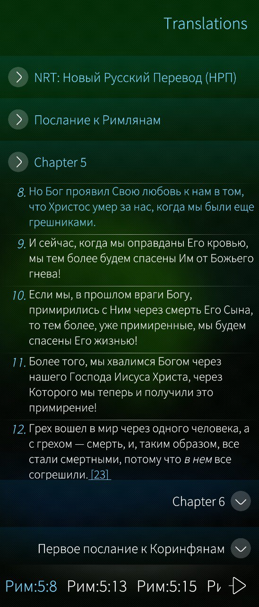
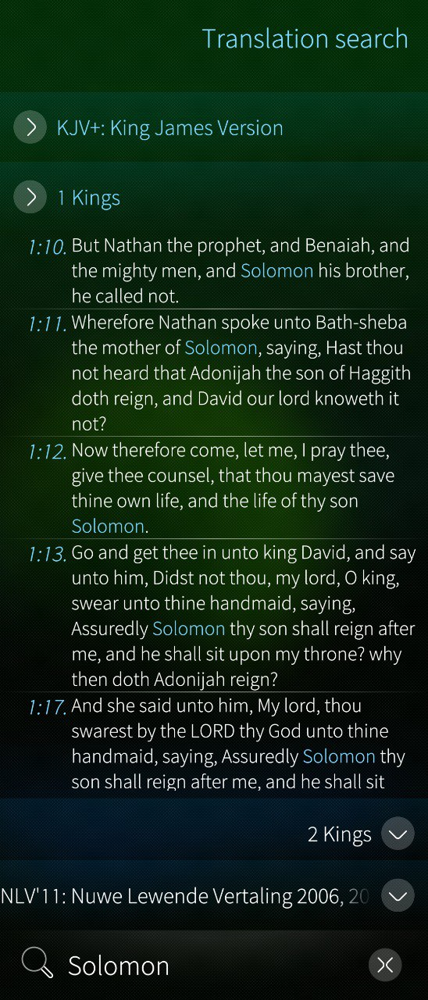
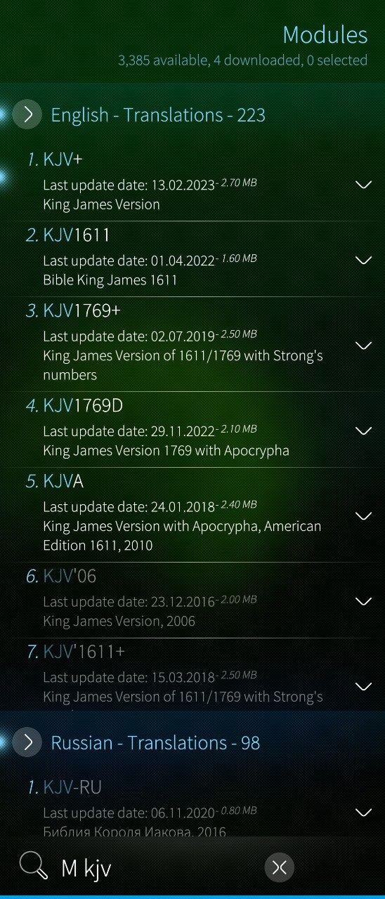

[](https://codecov.io/gh/spiritEcosse/bible)
[](https://www.codefactor.io/repository/github/spiritecosse/bible)
[](https://github.com/spiritEcosse/bible/actions/workflows/cpp-linter.yml)

---

# FreeBible

### The FreeBible application is completely free for learning and daily reading, and it is designed for everyone.

---

# About FreeBible

## Meet the Developer

Greetings, I'm Ihor Shevchenko 🌟

I'm the driving force behind FreeBible, and I'm thrilled to share my vision for this app with you. My journey is one 
fueled by a passion for making the Bible accessible to everyone, anytime, and anywhere.

---

## Who do I believe in?

I am Christian, and I believe in the Triune God: Father, Son, and Holy Spirit.

---

# My Vision

**FreeBible** was conceived from a dream to make the Bible readily available on any device, in multiple languages, 
with diverse commentaries, all while being completely offline, free, and free from ads. This dream stemmed from my 
desire to read the Bible on my Sailfish device and various other platforms, enabling easy sharing of thoughts and 
fostering a deeper understanding of God's profound teachings.

---

# My Mission

At FreeBible, my mission is inspired by **JOSHUA 1:8**:

'This book of the law shall not depart out of thy mouth; but thou shalt meditate therein day and night, that thou mayest observe to do according to all that is written therein: for then thou shalt make thy way prosperous, and then thou shalt have good success.'

---

# What is FreeBible?

**FreeBible** is an application designed to empower users with the ability to read the Bible effortlessly, offering 
a multitude of features:

- **Download Modules**: Access diverse translations with ease.
- **Remove Modules**: Customize your Bible library as per your preferences.
- **Read Offline**: Enjoy uninterrupted reading, even without an internet connection.
- **Reading History**: Easily track your reading progress.
- **Commentaries**: Gain insights with small commentaries linked to Bible verses.
- **Search Functionality**: Seamlessly search for specific verses across translations.

---

# The application available on Operating Systems:

## [Sailfish OS](https://sailfishos.org/)

## Other Operating Systems

Stay tuned for information on upcoming operating system releases. We will keep this section updated with details about 
new and exciting options for your device.

---

# Application Overview

The application is designed with three main pages:

## 1. Central Page - Modules by Translations

- This central page primarily focuses on displaying translations. Users can view one translation at a time, and there's an option to activate other translations for comparison or reference.
- At the bottom of this page, users can access their reading history, which includes a record of verses and books they have previously read.
- The navigation system within this page is user-friendly, allowing for easy movement between books and chapters within the translations.
- Offline reading functionality is supported, allowing users to access translations without an internet connection.
- Users can also access commentaries associated with the translations.

## 2. Left Page - Search by Verses

- The left page is dedicated to search functionality. Users can perform searches based on specific verses from the translations.
- When a user conducts a search, they can easily navigate to the translation page where the found verse is located for further exploration and context.

## 3. Right Page - List of Modules

- On the right page, users can manage the modules and translations available in the application.
- The system can download translations in various languages from the internet, expanding the available options.
- Users have the ability to remove translations they no longer need or want.
- Navigation within this page is designed to make it easy for users to switch between different modules.
- Additionally, users can search for specific modules by name, simplifying the process of locating and activating desired translations.

This three-page design offers a comprehensive and user-friendly experience for accessing, searching, and managing translations and related content within the application.

---

# Screenshots




---

# Sailfish OS RPM Package Installation

This guide provides instructions on how to install RPM packages on Sailfish OS using various methods: via the Jolla Store, manually using `pkcon`, and manually using `zypper`.

## Installing RPM Packages via Jolla Store

1. Open the Jolla Store on your Sailfish device.

2. Search for the desired application or package.

3. On the package details page, click the "Install" button.

4. Follow the on-screen prompts to complete the installation.

## Installing RPM Packages Manually using `pkcon`

1. Transfer the RPM package file to your Sailfish device using methods like email, cloud storage, or USB connection.

2. Open the Terminal app on your Sailfish device.

3. Navigate to the directory containing the RPM package:

   ```bash
   cd /path/to/your/package/
   ```

4. Install the RPM package using `pkcon`:

   ```bash
   pkcon install-local filename.rpm
   ```

   Replace `filename.rpm` with the actual name of your RPM package file.

5. Enter your password when prompted to authorize the installation.

6. Wait for the installation to complete, and you should see a confirmation message.

## Installing RPM Packages Manually using `zypper`

**Note**: If `zypper` is not already installed on your device, follow these steps to install it:

1. Open the Terminal app on your Sailfish device.

2. To enable developer mode, set a password:

   ```bash
   devel-su
   ```

   Follow the prompts to set a password for developer mode.

3. Update the package manager and install `zypper`:

   ```bash
   pkcon refresh
   pkcon install zypper
   ```

   Follow any prompts and provide your password when requested.

4. Once `zypper` is installed, you can use it to install RPM packages:

   ```bash
   zypper install --details /path/to/your/package/filename.rpm
   ```

   Replace `/path/to/your/package/filename.rpm` with the actual path to your RPM package.

Please ensure that you handle dependencies appropriately when using manual installation methods (`pkcon` and `zypper`),
as these methods may require more manual management of dependencies compared to the Jolla Store.

---

# Compatibility

This project has been tested on the following versions of Sailfish OS:

- 4.5.0.19

---

# Running tests

## Unix OS

```bash
# e - script stops on error (return != 0)
# u - error if undefined variable
# o pipefail - script fails if one of piped command fails
# x - output each line (debug)

set -euox pipefail
git clone https://github.com/spiritEcosse/bible
export FREEBIBLE_PATH_BUILD=`pwd`/bible_build
export FREEBIBLE_PATH_SRC=`pwd`/bible
mkdir ${FREEBIBLE_PATH_BUILD}
cd ${FREEBIBLE_PATH_BUILD}
cmake -DCMAKE_BUILD_TYPE=Debug -DBUILD_TESTING=ON -S ${FREEBIBLE_PATH_SRC} -B ${FREEBIBLE_PATH_BUILD}
cmake --build ${FREEBIBLE_PATH_BUILD} -j "$((2 * $(getconf _NPROCESSORS_ONLN)))"
ctest --output-on-failure
```

---

# TODO

- Adding settings
- Support commentaries
- Support cover page for Sailfish OS
  - display a spinner during the post-installation process following the application installation
  - show status of loading list of modules
  - show status of loading modules
  - show count of loading modules
  - show verses
  - add carousel for 3 pages
- Adding bookmarks
- Adding dictionaries
- Adding notes
- Adding audio notes
- Convert audio to text
- Auditory presentation of textual information
- Adding fonts
- Support strong numbers
- Adding notifications


## Support all modern platforms

- Linux 
- Mac OS 
- Windows
- Android
- iOS

## Responsive Design

- Tablet
- Desktop
- Mobile


## Embrace all popular configurations architectures

---

# Contribute to FreeBible

If you have experience in UI design, programming skills, or simply carry a spark of inspiration for this app, we invite 
you to become a part of my mission. Your involvement can significantly shape the future of FreeBible.

Whether you're a design virtuoso, a coding maestro, or just someone bursting with creative ideas, we wholeheartedly 
welcome your participation and support. Don't hesitate to reach out and join me in making FreeBible even better. 
Your contributions are priceless!

If you come across any problems or have any suggestions, please don't hesitate to share them with us on our GitHub page 
at https://github.com/spiritEcosse/bible/issues.

Alternatively, if you'd like, you can simply treat me to a coffee.

<a href="https://www.buymeacoffee.com/shevchenkco" target="_blank"></a>

---

# Contact Me

You can contact me via email at [shevchenkcoigor@gmail.com](mailto:shevchenkcoigor@gmail.com) for further information or inquiries.

---

# Licensing

This project is released under the GNU General Public License v3.0 (GPL-3.0), a widely used open-source software license.

---

# Special Thanks

I extend my heartfelt gratitude to those who have contributed to the FreeBible project:

- **My God**: Because without His invisible cooperation it would be impossible, i guess.
- **My wife Oksana Shevchenko**: For her assistance with the app's icon and constant inspiration.
- **Team of <a href="https://mybible.zone/en/">MyBible</a>**: For their agreement to grant me access to mybible modules.
- **Contributors of <a href="https://github.com/fnc12/sqlite_orm" >sqlite_orm</a>**: For their AGPL-licensed open-source project.
- **Contributors of <a href="https://github.com/stachenov/quazip">quazip</a>**: For their valuable contributions.
- **Contributors of <a href="https://github.com/llvm/llvm-project">llvm</a>**: For their work on the LLVM project.
- **Contributors of <a href="https://github.com/linux-test-project/lcov">lcov</a>**: For their contributions to the Linux Test Project.
- **Contributors of <a href="https://github.com/openssl/openssl">openssl</a>**: For their work on the OpenSSL project.
- **Contributors of <a href="https://curl.se/">curl</a>**: For their dedication to the curl project.
- **Contributors of <a href="https://github.com/StableCoder/cmake-scripts">cmake-scripts</a>**: For their invaluable contributions to the development process.

Your support and collaboration have played a pivotal role in shaping FreeBible into what it is today.
Your support has been instrumental in making FreeBible what it is today.
I deeply appreciate your commitment to this project.

Thank you for joining us on this enlightening journey.

Warm regards,

Ihor Shevchenko

---
